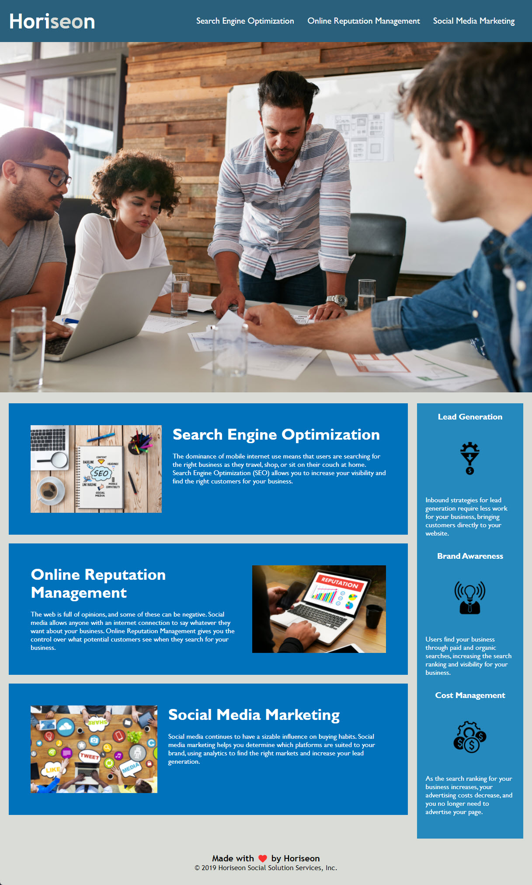

In Challenge One of the UTSA Coding Bootcamp, we were given a directive of refactoring existing code for the Horiseon webpage. 

The scenario provided was: the Marketing Agency of Horiseon wanted to ensure their code was up to accessibility standards so that their website is optimized for search engines. 

We also had a directive of Scouts Rule - which I really enjoyed. Scouts Rule's premise is "leave something better than you found it". In additon to making Horiseon's code accessible, I wanted to make sure the structure and CSS Style Page was optimized and sequential. 

This was an individual assignment, so I was the only contributor to this "clean up" - UTSA advised to clone the starter code for this Challenge from Xandromus on GitHub. 

All changes were done in VS Studio Code, Added/Committed/Pushed up from GitBash and sent to a GitHub repository named amhernandez1163/Challenge-One. 

GitHub also hosts my URL for changes made to be displayed: https://amhernandez1163.github.io/Challenge-One/ 

The webpage should populate displaying the following: 

